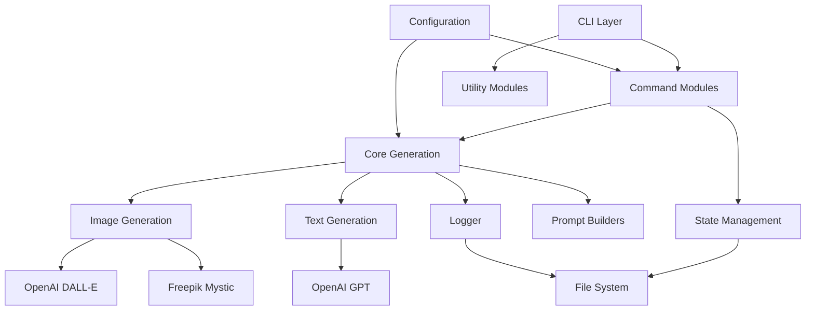
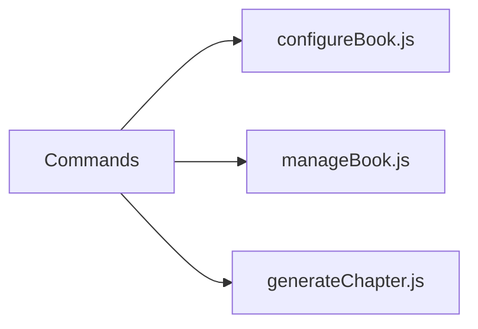
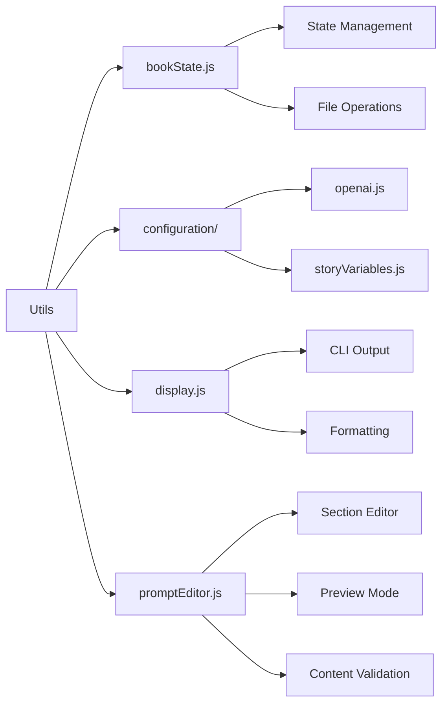
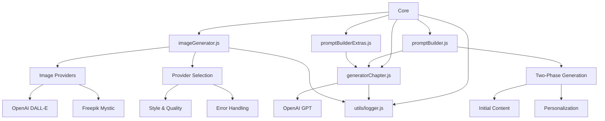
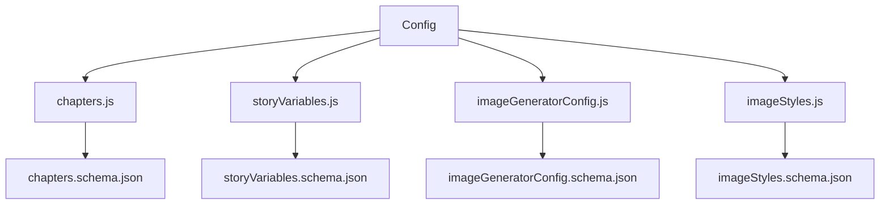
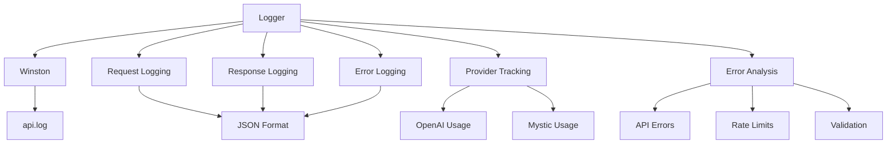

# System Patterns: Book Generator Architecture

## Architecture Overview



## Core Components

### 1. CLI Layer (`src/cli/index.js`)

- Entry point for the application
- Manages main menu and navigation
- Delegates to specific command modules
- Handles user interaction flow

### 2. Command Modules (`src/cli/commands/`)



- **configureBook.js**: Handles initial book setup and configuration
- **manageBook.js**: Manages book operations and status
- **generateChapter.js**: Controls chapter generation workflow

### 3. Utility Modules (`src/cli/utils/`)



- **bookState.js**: Manages book state and persistence
- **configuration/**: Specialized configuration utilities
  - **openai.js**: OpenAI settings management
  - **storyVariables.js**: Smart story variables workflow
    - Visual description prompting
    - Character details management
    - Section-based configuration
- **display.js**: Centralized CLI output formatting
  - Consistent visual indicators (✓, ○, ℹ)
  - Status-based color coding (green for accepted, gray for not generated)
  - Chapter formatting utilities (formatChapter)
  - Centralized console output handling
  - Standardized message types (info, success, error)
  - Consistent UI patterns across all commands
  - Single source of truth for display formatting
- **promptEditor.js**: Enhanced text editing utility
  - Section-based content management
  - Full editor integration
  - Pre-populated content
  - Markdown syntax support
  - Content validation
  - Preview functionality

### 4. Core Generation (`src/`)



- **generatorChapter.js**: Text generation using GPT-4
- **imageGenerator.js**: Multi-provider image generation
  - Provider selection (OpenAI/Mystic)
  - Style selection
  - Scene composition
  - Character consistency
  - Quality parameters
  - Provider-specific optimizations
- **promptBuilder.js**: Two-step content generation
  - Initial generation with minimal context
  - Personalization with full context
  - Dynamic context cleaning
  - Natural language integration
  - Smart empty value filtering
- **promptBuilderExtras.js**: Specialized content prompts
  - Introduction generation with two-step approach
  - Concept definitions
  - Trivia generation
- **utils/logger.js**: API interaction logging

### 5. Configuration (`config/`)



- **chapters.js**: Book content structure
- **storyVariables.js**: Story customization settings
- **imageGeneratorConfig.js**: Image generation configurations
  - Provider selection
  - Provider-specific settings
  - Common parameters
- **imageStyles.js**: Image generation styles and presets
- Schema files for validation

### 6. Logging System (`src/utils/logger.js`)



- Winston configuration
- JSON formatted logs
- Request/response tracking
- Error monitoring
- Multi-provider API usage logging

## File Organization

```text
libro-economia-prole/
├── books/              # Generated books
│   └── [book-name]/   # Individual book directories
│       ├── book-state.json  # State and metadata
│       ├── content.md       # Accepted content
│       └── images/          # Generated images
├── tmp/                # Temporary image storage
├── config/             # Configuration files
│   ├── chapters.js
│   ├── storyVariables.js
│   ├── imageGeneratorConfig.js
│   ├── imageStyles.js
│   └── *.schema.json   # JSON schemas
└── src/               # Source code
    ├── cli/           # CLI implementation
    │   ├── commands/  # Command modules
    │   └── utils/     # Utility functions
    │       ├── configuration/  # Configuration utilities
    │       │   ├── openai.js   # OpenAI config management
    │       │   └── storyVariables.js  # Story variables workflow
    │       └── bookState.js    # State management
    ├── utils/         # Core utilities
    │   └── logger.js  # Logging system
    ├── promptBuilder.js       # Main prompt builder
    ├── promptBuilderExtras.js # Specialized prompts
    └── *.js           # Core generation logic
```

## Design Patterns

### 1. Command Pattern
- Each CLI command is a separate module
- Consistent interface for all commands
- Encapsulated functionality

### 2. State Management
- Centralized state in book-state.json
- Atomic state updates
- State validation before saves

### 3. Two-Step Generation Pattern
- Initial generation with minimal context
  - Uses only essential character details
  - Focuses on creative storytelling
  - Maintains educational objectives
- Personalization with full context
  - Natural integration of story details
  - Character and setting enrichment
  - Maintains core narrative
- Applied consistently across:
  - Regular chapters
  - Book introduction
  - Specialized content

### 4. Builder Pattern
- Used in promptBuilder.js and promptBuilderExtras.js
- Two-phase prompt construction
  - Initial generation prompts
  - Personalization prompts
- Maintains consistency
- Specialized builders for different content types

### 4. Factory Pattern
- Creates new book instances
- Initializes with default structure
- Ensures consistency

### 5. Strategy Pattern (Image Generation)
- Multiple image generation providers
- Provider-specific implementations
- Common interface
- Runtime provider selection
- Different visual styles
- Scene composition presets
- Character consistency strategies

### 6. Observer Pattern (Logging)
- Monitors API interactions
- Records requests and responses
- Tracks errors and usage
- Multi-provider support

### 8. Context Cleaning Pattern
- Recursive object cleaning
- Automatic empty value removal
- Dynamic structure preservation
- Smart data filtering
- Future-proof context handling
- Natural language integration
- Flexible data presentation

## Technical Decisions

### 1. ES Modules
- Modern JavaScript module system
- Better dependency management
- Cleaner import/export syntax

### 2. File Structure
- Separate state from content
- JSON for state (structured data)
- Markdown for content (readable format)
- Configuration in dedicated directory
- Temporary storage for review

### 3. Status Tracking
- Three clear states: generated, wip, accepted
- Separate tracking for text and images
- Progress calculation based on status

### 4. Image Generation
- Multi-provider architecture
- Provider-specific optimizations
- Common interface
- Style-based generation
- Scene composition presets
- Character consistency
- Local storage workflow
- Review process

### 5. API Integration
- Direct API integration
- Configurable providers and parameters
- Error handling and retries
- Request/response logging
- Provider-specific error handling

## Error Handling

### 1. API Errors
- Provider-specific error handling
- Retry mechanism for transient failures
- Clear error messages
- State preservation on failure
- Error logging

### 2. File System Errors
- Atomic write operations
- Backup before updates
- Recovery procedures
- Temporary file management

### 3. User Input Validation
- Input sanitization
- Format validation
- Meaningful error messages
- Automatic safe filename generation

## Performance Considerations

### 1. State Management
- Minimal state updates
- Efficient file operations
- Caching when appropriate

### 2. API Usage
- Provider-specific optimizations
- Batch operations where possible
- Resource cleanup
- Rate limiting compliance
- Usage tracking

### 3. Memory Usage
- Stream large files
- Clean up temporary resources
- Manage context size
- Log rotation
